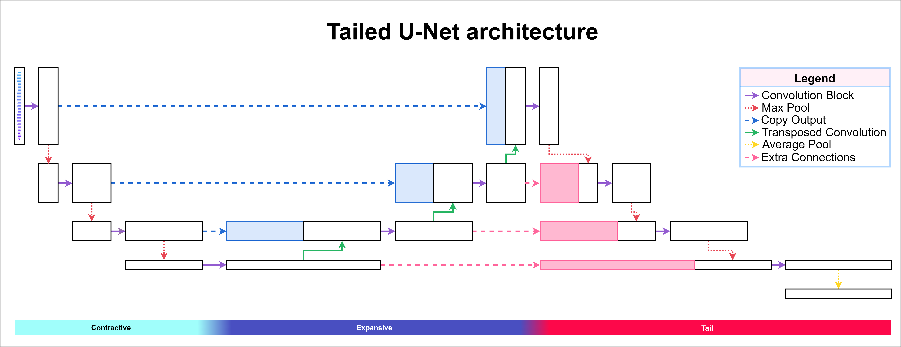

# TUNe

This repository contains the code to reproduce the experiments from the paper ['Tailed U-Net: Multi-Scale Music Representation Learning'](https://ismir2022program.ismir.net/poster_109.html) 
, which is a mix of [Spijkervets & Burgoyne (2021)](https://github.com/Spijkervet/CLMR) and [Castellon et al. (2021)](https://github.com/p-lambda/jukemir) repositories.

[The weights for the trained models are available at here](https://drive.google.com/drive/folders/1MZZs-CRVibaLuW_zmV9KB8sPy495qERJ)

The TUNe architecture:



### MagnaTagATune results 
Our main results we obtained with our two best performing models representations on MTT are:

| Model   | Supervised | # parameters (M) | Epochs | Fine-tune head    | ROC-AUC | PR-AUC |
|---------|------------|------------------|-------:|-------------------|---------|--------|
| TUNe    | X          | 2.1              |  10000 | Linear Classifier | 89.5    | 37.0   |
| TUNe+   | X          | 2.2              |  10000 | Linear Classifier | 89.3    | 37.1   |
| CLMR    | X          | 2.4              |  10000 | Linear Classifier | 88.7    | 35.6   |
| musicnn | ✓          | 11.8*            |  10000 | Jukemir Probe     | 90.7    | 38.4   |
* Last reported number of parameters was from [Pons et al. (2017)](https://arxiv.org/pdf/1711.02520.pdf)
### Castellon et al.(2021)-like  probing results

| Model   | MTT_{ROC} | MTT_{AP} | GTZAN | GiantSteps | EMO_{A} | EMO_{V} |
|---------|-----------|----------|------:|------------|---------|---------|
| TUNe    | 90.3      | 38.1     |  67.6 | 13.7       | 60.5    | 55.7    |
| TUNe+   | 90.3      | 38.0     |  64.5 | 15.5       | 64.7    | 45.9    |
| CLMR    | 89.4      | 36.1     |  68.6 | 14.9       | 67.8    | 45.8    |
| Jukebox | 91.5      | 41.4     |  79.7 | 66.7       | 72.1    | 61.7    |


# Overview
1. [Getting Started](#getting-started)
2. [Training TUNe with CLMR]()
   1. [Preprocessing the data]()
   2. [Self supervised training]()
   3. [Evaluation of learned representations]()
3. [Probing like Jukemir]()
   1. [Preprocessing the data]()
   2. [Extracting representations]()
   3. [Run probe sweep]()
   4. [Evaluation of best performing probe]()
4. [Appendix]()
   1. [GitHub directory layout]()
   2. [Obtaining GTZAN]()
   3. [Pretraining on own audio (as per CLMR)]()
   3. [Altered code]()

# 0. Getting started <a name="getting-started"></a>

```
# cloning the repository
git clone https://github.com/Marcel-Velez/TUNe.git

# enter the cloned repository
cd TUNe

# install the dependencies
pip3 install -r requirements.txt
```
After these steps you can go two ways, first we will explain how to train our TUNe model(s) with the CLMR framework. 
Second, we will exlpain how to probe said trained models on the jukemir tasks.

# 1. Training TUNe with CLMR 
This segment is based on the repository of from [Janne Spijkervet (Spijkervet & Burgoyne (2021))](https://github.com/Spijkervet/CLMR). 
Part 1 and 3 can be ran on Windows, 
part 2 needs linux or mac because of the _'soundfile'_ backend needed for some of the audio augmentations used in CLMR framework.

The parameter options and their default value can be found in './config/config.yaml'
   ## 1.1 Preprocessing the data
First we have to download the datasets we want to use the audio of (default: MagnaTagATune)
```python
# download a dataset and preprocess it to the .mp3 and certain samplerate
python3 clmr_preprocess.py

# download a different dataset
python3 clmr_preprocess.py --data gtzan
```
   ## 1.2 Self supervised training
The Contrastive learning of musical representations
```python
# download a dataset and preprocess the data, e.g. convert it to the .mp3 with a specific samplerate
python3 clmr_preprocess.py

# train a model (default: TunePlus) with an m1 chip
python3 clmr_main.py --accelerator mps --workers 10


# continue training from a checkpoint
# runs are automatically checkpointed when training in './runs/lightning_logs/XXX' 
python3 clmr_main.py --checkpoint_path ./runs/lightning_logs/XXX/checkpoints/epoch=YYYY-step=ZZZZZ.ckpt --accelerator mps --workers 10
```

   ## 1.3 Evaluation of learned representations
In order to evaluate a learned representation, one has to pass along the path to the trained model:
```python
# run the evaluation script for a given checkpoint of a trained model
python3 clmr_linear_evaluation.py --checkpoint_path ./runs/lightning_logs/XXX/checkpoints/epoch=YYYY-step=ZZZZZ.ckpt
```

# 2. Probing like Jukemir
 This section explains how the repository of [Castellon et al. (2021)](https://github.com/p-lambda/jukemir) can be used on CLMR trained models
 The code has been slightly altered and combined from the original repository. All these steps are 
executable on windows, mac, and linux.

   ## 2.1 Preprocessing the data
The jukemir_preprocess.sh will execute a bash file where we loop over the four datasets, first downloading all datasets 
and then converting the audio to the same type and samplerate. The audio will be stored in the 
_'./data/DATASET_NAME'_ repository. _NOTE: MagnaTagATune is shared by both Jukemir and CLMR so will not be downloaded twice._
```bash
# execute the bash file
bash jukemir_preprocess.sh
```
   ## 2.2 extracting representations
The default location for the Tune5Tail and TunePlus model are : './checkpoints/tune_5_tail_epoch_10000.ckpt' and './checkpoints/tune_plus_epoch_10000.ckpt'
For custom models one has to (import has to be added to the python file) and specify the path to the trained custom model checkpoint
```python
# extract representations for the MagnaTagATune dataset for the default model, TunePlus
python3 jukemir_extract_representations --data magna

# extract representations for the Emomusic dataset for the default model, TunePlus
python3 jukemir_extract_representations --data emomu

# extract representations for the GTZAN fault-filtered dataset for the Tune5Tail model
python3 jukemir_extract_representations --data gtzan --model Tune5Tail

# extract representations for the giantsteps dataset for a custom model 
python3 jukemir_extract_representations --data giant --model custom_model --checkpoint ./path/to/checkpoint
```

This took a couple of minutes for the Emomusic dataset up to 10 hours for the Giantsteps dataset and for
MagnaTagATune and GTZAN around 2-3 hours.

   ## 2.3 Run probe sweep
This is the sequential training of the probes, the original authors also offer a parallel way of training on their 
repository. The 'jukemir_train_probes.py' first creates configurations for every dataset according to [Castellon et al. (2021)](https://github.com/p-lambda/jukemir) 
probe parameter configuration. Next every probe is trained for every dataset (216 probes per dataset).
```python
# run the probe training script
python3 jukemir_train_probes.py
```

   ## 2.4 Evaluation of best performing probe
```python
# evaluate the performance of the best probe configuration for every of the 4 dataset
bash jukemir_evaluate.sh
```
# Appendix

[//]: # (   ## Github directory layout)

[//]: # (   ## Obtaining GTZAN)

[//]: # (   ## Pretraining on own audio &#40;as per CLMR&#41;)

[//]: # (   ## Altered code)

## Code alterations

- changed part of the gtzan.py code from clmr in "clmr/datasets/gtzan.py" because the download link from the gtzan dataset was unavailable at the time of writing.
- added checkpoint saving every 200 epochs to "clmr.XXXX.contrastivelearning.py" line 35/36
